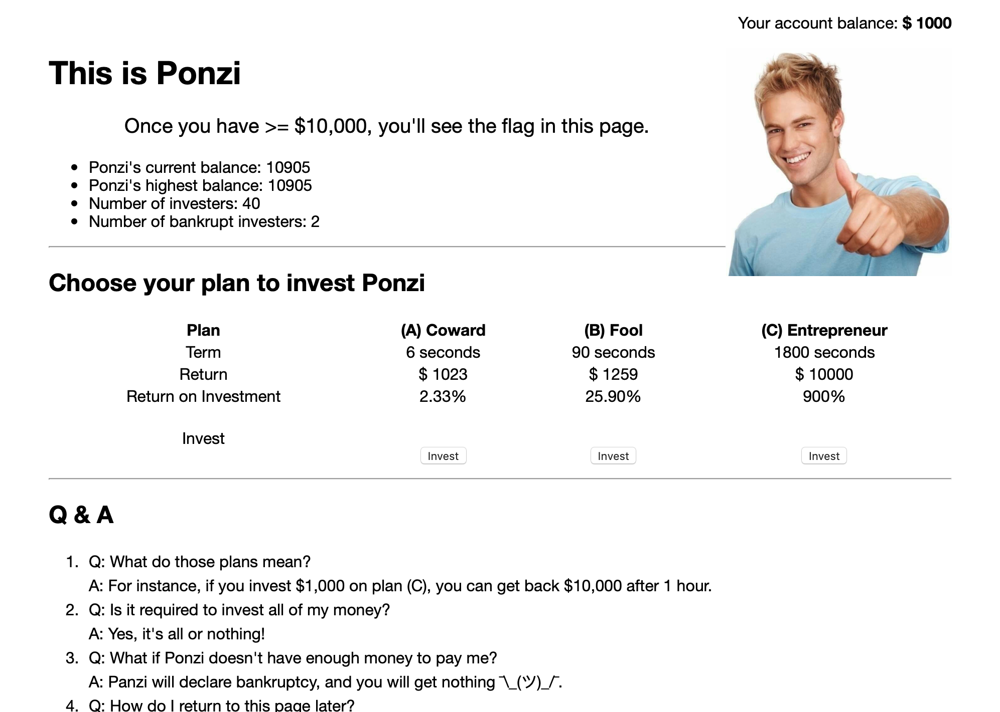
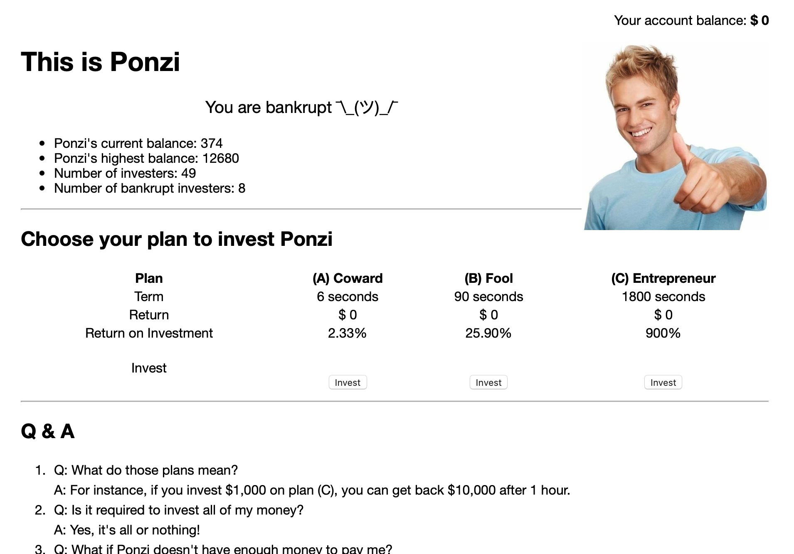
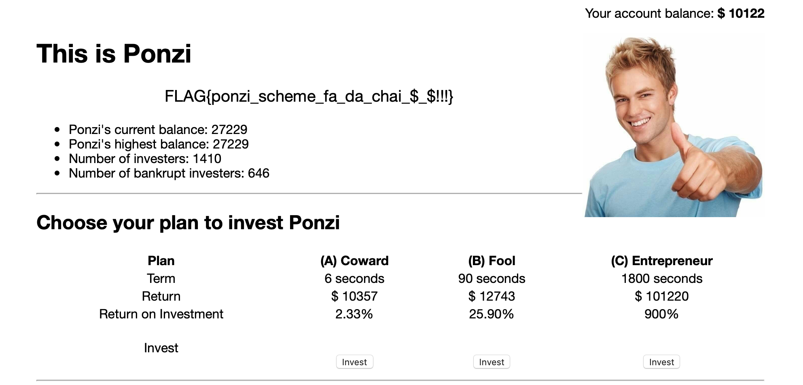
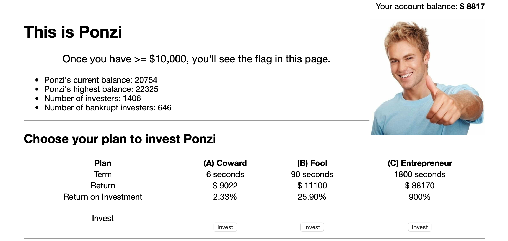
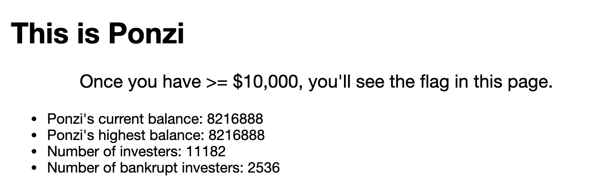

# Ponzi Scheme

Misc, 145/500 Points

Writeup By: **yctseng1227**

## Description

> 由於官方題目網站已關閉，以下只能簡述題目

好像也沒什麼好說明... 看圖。

## Solution

僅次於`Welcome`的分數，看起來大家都玩得很開心XD

把題目`Ponzi Scheme`拿去Google，可以知道這是一場[龐氏騙局](https://zh.wikipedia.org/wiki/龐茲騙局)XD

先說說帳號建立的部分，這裡採用的是[Proof-of-Work(PoW)](https://en.wikipedia.org/wiki/Proof_of_work)的策略，這是一種避免短時間多開帳號資源濫用的一種經濟對策，總之就是打開網頁後會給一串22碼的Hash `h(n)`，要求你回推出`n`。

印象中題目敘述有提供balsn的[PoW tool](https://balsn.tw/proof-of-work)，總之創立帳號並不是馬上就能完成的事，還需要時間透過窮舉計算才行。

再來回到投資頁面，簡單講就是給你三種方案，想辦法把一開始給的$1000用錢滾錢的方式滾到$10000就會噴出Flag。

不過有兩件事要注意:

1. 投資只能**ALL IN**，並沒有拿一部分錢去投資這種選項
2. 錢丟進去的pool是所有投資帳號共有，如果時間到了但pool裡的錢不夠Return金額，那你就拿不到錢（等同於破產），如下方附圖。

做法百百種。 最保險的做法就是開一個帳號作為`master`和十個帳號作為`slave`，並且在master選擇完C方案等到29分50秒時，再將其他10個slave選擇B方案把錢投進pool，確保在master的C方案時間到的時候可以拿回$10000。

但し！！

正如前面PoW所描述，要建立11個帳號確實可行，但再運算時間上不知道會耗費多久 ~~（懶癌發作）~~，因此我在一陣打滾、破產多次後想了另一種辦法。

> 建立兩個帳號A、B，並且同樣都選擇(A)方案進行操作。

我的投想法是當兩個帳號同時把$1000丟進pool，6秒後至少其中一個帳號能把錢拿回來，在其他玩家也把錢丟進pool的前提下幾乎確定兩個帳都能拿到錢，只需要觀察pool裡的錢不要剩太少就不太會有問題。

如此反覆地把兩個帳號的錢丟進pool就能把錢洗到$10000了 = v =!!
即便如此我還是以防萬一地開了C帳號選擇(B)方案90秒，深怕有個萬一還要重來很麻煩XDDD 

`帳號 A`

`帳號 B`（開帳號的時間比較晚）

**`FLAG{ponzi_scheme_fa_da_chai_$_$!!!}`**

---

雖然還是有點運氣成份，不過從圖片可以看到解出flag當下pool還有$20000多根本就是穩拿~ 

聽說有其他隊伍用各種方式操（ㄨㄢˊ）作（ㄋㄨㄥˋ）這題XDDDDD
還有從賽後聊天室截到的這張圖根本神誇張，只能說... 不EY啦 ㄏ

