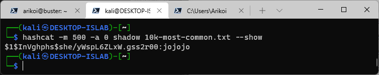

# hash

## [40] hash meow
### **topic**
駭客貓貓不小心把晚餐鎖起來了，都是密碼被hash的錯，成為hash meow hacker，幫駭客貓貓找回root密碼！

請利用找到的密碼連入mid.macacahub.tw:20000，取得hacker_meow的晚餐。

對了，為了方便鎖匠作業，駭客貓貓的密碼好像都從10k-most-common.txt裡面選的樣子。

ssh mid.macacahub.tw -p 20000 -l root

### **hint**
> [hashcat tutorial](https://resources.infosecinstitute.com/topic/hashcat-tutorial-beginners/)
> 
> [check the hash type](https://hashes.com/en/tools/hash_identifier)

### **solution**
根據題意敘述，我們需要先幫駭客貓貓找到正確的密碼。

可以使用 hashcat 或是 john the ripper，不過駭客貓貓比較喜歡 hashcat。

跟據題意 shadow 內只有 root 是需要處理的。
```shell
root:$1$InVghphs$she/yWspL6ZLxW.gss2r00:0:0:root:/root:/bin/bash
```

關於 shadow 可以上[這裡](https://blog.gtwang.org/linux/linux-etc-shadow-file-format/)看看，不過其實不用太在意，整串丟給 hashcat 即可。

[10k-most-common.txt](https://github.com/danielmiessler/SecLists/blob/master/Passwords/Common-Credentials/10k-most-common.txt)

如果執行有誤，記得確認 hash type。

再結合題目提供的字典檔，可以完成以下的指令。

```shell=
hashcat -m 500 -a 0 shadow 10k-most-common.txt
hashcat -m 500 -a 0 shadow 10k-most-common.txt --show
```



之後利用 root:jojojo 連入主機應可看到 hacker_meow 留下的flag
