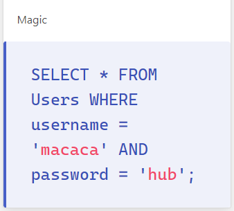
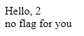

# sql

## [40] let cat in 1
### **topic**
駭客貓貓找到一個神奇的登入頁面，裡面貌似傳出flag的香味，請幫駭客貓貓取得flag！

但聽說flag只有admin可以取得？

http://mid.macacahub.tw:10210

### **hint**
> https://en.wikipedia.org/wiki/SQL_injection

### **solution**
直接連入網站後，可以發現網站有提供Magic，是檢查payload完整的好工具。

會告訴你帳號密碼輸入後的sql語法長什麼樣子。

> 

因為是第一題，設定上沒有擋任何字元，只需要基本的 SQL Injection 語法即可。
1. admin' ; -- 
> 利用註解讓與法變成下面的形式，註解後的東西( ' ADN password = ''; )不執行。
> 
> SELECT * FROM Users WHERE username = 'admin' ; -- ' AND password = '';
> 
> 帳號：admin' ; -- 
> 
> 密碼：隨意輸入

2. ' OR '1' = '1
> 使where判斷恆為True以繞過，因為判斷順序的關係，須放在密碼欄位才有效。
> 
> 帳號：admim
> 
> 密碼：' OR '1'='1

登入後即可取得flag

## [30] let cat in 2
### **topic**
meow~ meow~ 這裡面似乎有更香的flag，可是防護看起來更嚴密了，請幫駭客貓貓取得flag！

註記：帳號請登入admin

http://mid.macacahub.tw:10220

### **hint**
>1 > 1 ?
1 < 1 ?
1 <> 1 ?
1 = 1 !!

### **solution**
這次提供網頁原始碼，不提供Magic，觀察原始碼發現網站會驗證輸入。

不得使用 ';' 、 '--' 、 '#' 及 '=' 這四種輸入

因此第一題適用的註解法在第二題理論上行不通。

利用OR使判斷條件恆為True也會卡在=不能輸入。

但是並沒有擋OR，根據hint，修改 1=1 為 2>1 或是 1<3 都可以使得條件判斷為 True。

登入後即可取得flag

範例payload：
>帳號：admin
>
>密碼：' OR '2' > '1
>
>注意需要加上單引號使查詢語句完整。

## [20] let cat in 3
### **topic**
大駭客貓貓用hacker_meow的身分，把flag悄悄的放在別人的伺服器上，但是hacker_meow帳號似乎被刪除了？

沒有帳號要怎麼登入呢？

請幫幫苦惱的駭客貓貓找回師傅留下的flag！

http://mid.macacahub.tw:10230

### **hint**
> UNION...好像可以做出任意的資料...的樣子？

### **solution**
根據題意，此次須使用帳號hacker_meow登入，但是hacker_meow帳號並不存在於資料庫中。

因此我們需要能產生資料的語法，而不能單純利用註解或是修改判斷條件繞過。

> SELECT username, password FROM Users 會產生以下資料
> 
> | username | password |
> | ------------- | ------------- |
> | xxx | ooo |
> | ... | ... |
>
> SELECT username, password FROM Users UNION SELECT 1,2 會產生以下資料
> 
> | username | password |
> | ------------- | ------------- |
> | xxx | ooo |
> | ... | ... |
> | 1 | 2 |
>
> 最後一筆的 1,2 其實就是 union select 出來的假資料。
> 
> 但是使用 union 有一點限制，欄位數必須與前面取出的資料相等。
> 
> 因此在嘗試 union 時需要先猜測欄位數。
> 
> 此處可以暴力使用 union select 1,2,3,...
> 
> 持續增加欄位數直到網頁正常為止。
> 
> 範例payload：
> 
> > 帳號：任意輸入
> > 
> > 密碼：' union select '1
> > 
> > 密碼：' union select 1,'2
> > 密碼：' union select 1,2,'3
> > 
> > ...
> > 
> > 須注意最後一位強制要求單引號，以使得sql語法完整。

在猜測欄位正常登入後，應會顯示如下：

因此猜測上面payload放2的位置會對應到username，修改 2 為 hacker_meow 應可正常登入取得flag。

範例payload：
> 帳號：任意輸入
> 
> 密碼：' union select 1,'hacker_meow
> 
> 密碼：' union select 1,'hacker_meow','3
> 
> 密碼：' union select 1,'hacker_meow',3,'4
> 
> ...
