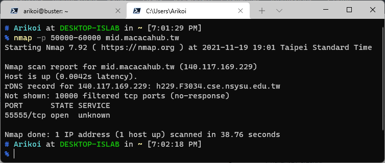
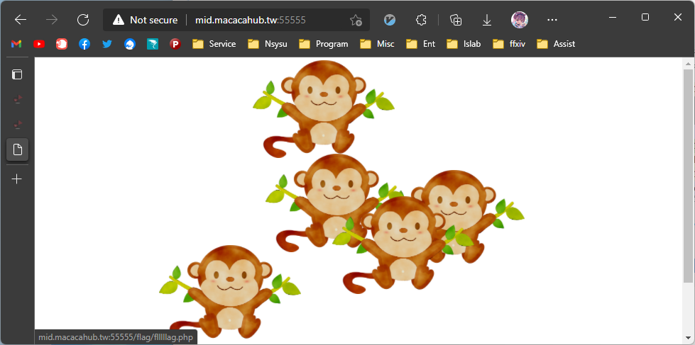

# port scan

## [40] monkeys' island
### **topic**
駭客貓貓在猴子島觀光時被猴子打跑了，flag也被猴子搶走了！

好不容易跑出猴子島的駭客貓貓也忘記如何前往猴子島了，依稀記得島上 (mid.macacahub.tw) 的50000號港口到60000號港口間有船隻前往

請幫駭客貓貓找到猴子島入口，搶回flag！

### **hint**
> nmap -p XXXX-XXXX
> 
> the monkeys' name?

### **solution**
依據題意需先掃描 port 找到正確的港口。
> 

之後上[島](mid.macacahub.tw:55555)抓猴子。
> 

島上有五隻猴子，除了正確的猴子，其他猴子都只會亂叫。
> oo oa aa ao aaa a oooo oa aoao aoa o oao aa aaa ao aoa o aoaa

抓猴子有幾種作法。
縮小視窗關猴子，或是利用f12觀察每個猴子手上的flag。
從 flag.php 到 flllllag.php 都點過後應可取得flag

> 小彩蛋，把猴子說的話，o視作短音，a視作長音，可以解開摩斯密碼
> 
> iamnothackermonkey
