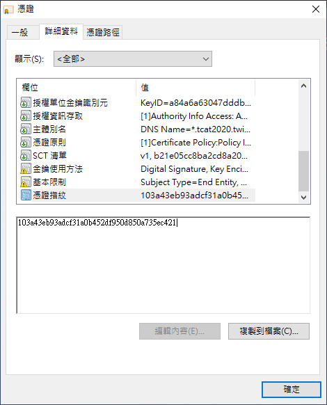

# 2020 T貓盃全國資安基礎實務能力競賽

Date(UTC+8): 2020.5.23(Sat.) 9:30 - 11:30

Site: https://es.tcat2020.twisc.ncku.edu.tw

Main Author: **yctseng1227**

## Info

1. 原訂時間為9:30-11:30(共120min)，由於中途發生各種連線事故，延至13:00。

2. 原訂計分方式為每題前三名答對者得3分，第四到十名得2分，其餘者得1分。
主辦方在延長賽程同時決議於11:30前答對的分數，皆給予3分，如各題答對人數，不足10名者，其剩餘前10名，仍給予2分，其餘答對者，給予1分（詳見網站內官方說明）。

3. Writeup內`Q16`為各題解出Flag中Respond Header挾帶的Problem16線索。

4. Writeup內部分檔案未保留，僅供參考用。

5. 若對於解答有疑慮者，可以透過FB粉絲專頁聯絡我們，筆者窩只是來打雜DER

## Timeline

**9:30** 競賽開始

**10:48** 我方主動詢問網站嚴重延遲問題，官方提供新競賽連結

**11:35** 正式破台（全16題，前15題均於**11:30**前作答完成）

**11:52** 主動詢問才得知比賽要延長

**12:05** 向主辦方提出改善建議

**12:13** 主辦方公布延長競賽時間

## Result

Rank : 1 / 50(大專院校組)

Score(11:35) : 39


\* 依照主辦單位更新後的計分方式，沒意外應該是拿滿 48 分

## Solution

### Problem 1


Weak password: `admin` : `admin`

```
{"TCat2020":"24d267d39f5e76ffb28ad52a7a44ceecdc686d32"}
Q16: N
```


### Problem 2


SQL injection: `' or 1=1 -- ` : `123`

```
{"TCat2020":"b63901c37725763b508a1a9c4ad3c70745c4c147"}
Q16: G
```

### Problem 3


SQL injection: `' or 1=1 -- ` : `123`

> 同Problem 2 payload ... XD

```
{"TCat2020":"8464c2b490bc3a0b9d9c6f52b7eb9ed8e81ab27d"}
Q16: B
```

### Problem 4


使用題目提供的帳密登入後把cookies修改為`admin`即可。

```
{"TCat2020":"6064e46dcd973d7d3cd01aa4a61286dcbee55fb0"}
Q16:X
```

### Problem 5


```php=
<?php
    error_reporting(E_ALL^E_NOTICE^E_WARNING);
    $search = isset($_GET['user_search']) ? $_GET['user_search'] : 'searchContent';
    if($search === searchContent)
    {

    }
    else if(strpos($_SERVER['QUERY_STRING'],'user_search') !==false)
    {
        echo "<p>查詢指令不正確</p>" ;
    }
    else if($search < 1000)
    {
        echo "<p>查詢指令長度太短了</p>";
    }
    else if((string)$search > 0)	
    {
        echo "<p>查詢指令長度太長了</p>";
    }
    else
    {
        echo "<p>查詢結果</p>";
        echo "<p>{\"TCat2020\":\"???????????????????????????\"}</p>";
    }
?>
```

在分析 GET 後的內容時，若變數名稱本身包含 `_` 字元，傳遞參數時可輸入包含 `.`, `+`, `[`, `]` 的字串來繞過 strpos() 的剖析，例如 `user.search` 或是 `user+search` 等替代原先的 `user_search`，同樣也能成功，因此 strpos() 就會回傳 false。

而以下的 PHP 弱型別特性，除了成功繞過第三和第四個條件的同時，也能成功 GET `user_search`
> [] < 1000 為 true

> (string) [] > 0 為 false


solution
```
https://es.tcat2020.twisc.ncku.edu.tw:20005/?user+search[]=1
```

```
{"TCat2020":"d44e4fa5ed959e8928d621f8e40cbc1ba322a734"}
Q16: N
```


### Problem 6


搭配 [factordb.com](http://www.factordb.com) 將題目提供的參數丟進 [RSA online](https://www.cryptool.org/de/cto-highlights/rsa-schritt-fuer-schritt) 即可。

```
{"TCat2020":"7dd389e95512f6b81f88b9e0cd75181e7f9af984"}
Q16: B
```

### Problem 7


從題目連結可以取得[file](./file/p7_file)，利用Base64 Decode從Header可知為`.png`檔並將其復原，圖片內容為印度文，透過OCR轉成文字得到`बिल्ली {आप इसे टाइप नहीं कर सकते}`即可拿Flag。

```
{"TCat2020":"d2aebaf4755dc0d49074c10fd35327bd4cce2ae0"}
Q16: A
```

### Problem 8


 


送出指紋`103a43eb93adcf31a0b452df950d850a735ec421`即可拿到flag

```
{"TCat2020":"63aa5854bfc29c7ffc031c2c164a8f2a8aa26dbc"}
Q16: Q
```

### Problem 9


用Burp Suite增加以下header
```
X-Originating-IP: 192.168.10.251
X-Forwarded-For: 192.168.10.251
X-Remote-IP: 192.168.10.251
X-Remote-Addr: 192.168.10.251
Remote-Addr: 192.168.10.251
Client-IP: 192.168.10.251
```
最後是驗Client-IP

```
{"TCat2020":"ec3ffee70154b821ee42f1609bd8a012416729f1"}
Q16: J
```

### Problem 10


將題目提供的zip拿去做sha256，再利用[線上工具](https://emn178.github.io/online-tools/sha256_checksum.html)即可拿到Flag。


```
{"TCat2020":"66068cb93e8f39c3e23801c64f485458f2d4bf21"}
Q16: A
```

### Problem 11


zip字典爆破： 用`fcrackzip`搭配字典檔`rockyou.txt`爆zip即可拿到password:9527。


`TCat2020`:`Ru38q7MZPXE8PsSWRU8rzDWsCVuTvp63`

```
{"TCat2020":"923a0c74553e773ca79039787f80d9dbbc8d8276"}
Q16: R
```

### Problem 12


同第8題作法


```
{"TCat2020":"909c9c3a6f302fbbda2f117798c2091f780c2d63"}
Q16: K
```

### Problem 13


對TCP封包點擊Follow -> TCP Stream


右下Stream編號上下點一點就看的到了


account=admin

password=CvphvghcT9yh

或是File -> Export Objects -> HTTP


```
{"TCat2020":"e5e97ffb03902288a4e54d50916284c3cdd2a93e"}
Q16: X
```

### Problem 14


圖片中藏`zip`，用`foremost`拆圖片即可。

`TCat2020` : `m4xr+r8n%gmsq!ca`

```
{"TCat2020":"e4d862739dc7a0befe89dff6a50748cbdd8fde05"}
Q16: B
```

### Problem 15


sha1弱型別判斷

md5('240610708') == sha1('10932435112')
```php=
<?php
	error_reporting(E_ALL^E_NOTICE^E_WARNING);
	$account = $_POST['account'];
	$password = $_POST['password'];
	$Sourse = false;
	if(md5($account)==sha1($password))
	{
		$Sourse = true;
	}
	else
	{
		$Sourse = false;
	}
?>
```

```
Q16: M
```

### Problem 16


解法：找出前面15題解完的題目 Respond Header Q16的代碼，拼湊出來就是密碼。

密碼: NGBXNBAQJARKXBM

```
{"TCat2020":"f961598a8ba9a45c2bcea93e8bc3670bc9d4288d"}
```


## Feedback

這是我們第一次接觸T貓盃，但從歷屆的T貓盃評價來看實在難以期待有亮眼的呈現，今年也是不例外，相當可惜。

筆者的兩位隊友技能點大都在`PWN`、`Binary`，這場賽事顯然沒有他們大顯身手的餘地，但程度也足以愜意解題。整場很大的問題是連線十分不穩，光是連線看題目都要等上好一段時間，筆者解出來的Flag幾乎都交給隊友們提交（可能也該換電腦了），賽中一度被迫囤Flag慢慢等連線，沒有想到直接送request這招實在失策，錯失很多拿首殺的機會，從我們多次參加線上賽的經驗，本次的競賽體驗相當糟糕。

其次是官方的反應，所謂「會吵的小孩有糖吃」，雖然站在官方角度是就事論事針對個隊伍的提問予以回覆，但是筆者認為有些該公布的消息就要讓所有參賽者知道，例如提供新的競賽連結，雖然能理解是為了分流用但還是覺得有失公允，期待官方下次能讓人看到改善... 如果還有下次的話（汗）。